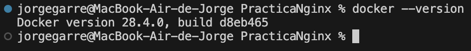
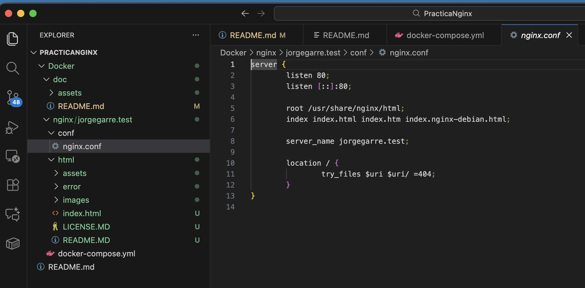
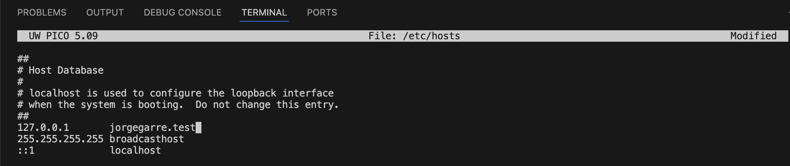
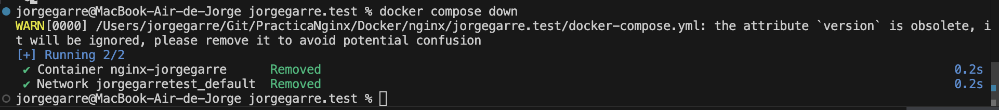

# Documentación Práctica Nginx Con Docker

**Autor:** Jorge Garre Corrales
**Proyecto:** Despliegue de servidor web Nginx usando Docker y Docker Compose

## Índice

1. [Instalación de Docker](#1-instalación-de-docker)
2. [Creación de la estructura de carpetas](#2-creación-de-la-estructura-de-carpetas)
3. [Crear y ejecutar el contenedor Docker](#3-crear-y-ejecutar-el-contenedor-docker)
   3.1 [Editar archivo /etc/hosts](#31-editar-archivo-etchosts)
   3.2 [Comprobar registros del servidor](#32-comprobar-registros-del-servidor)
   3.3 [Detener y eliminar contenedor](#33-detener-y-eliminar-contenedor)

## 1. Instalación de Docker

Lo primero que he hecho ha sido comprobar que tengo instalado Docker.

## 2. Creación de la estructura de carpetas

En la imagen se ve a la izquierda la estructura de carpetas, y como en la carpeta html esta clonado el repositorio de la práctica, además se ve el contenido de el fichero de configuración nginx.conf

## 3. Crear y ejecutar el contenedor Docker

Para el contenedor Docker he decidido hacerlo con Compose, por lo cual he tenido que crear un fichero docker-compose.yml, con la siguiente configuración.

Ahora lanzamos el contenedor para comprobar que la configuración es correcta.

Y en el navegador comprobamos que el servidor funciona

### 3.1 Editar archivo /etc/hosts

Una vez añadido el nombre del dominio y al haber movido la carpeta html con el repositorio, me aparece el index.html del repositorio que hemos descargado.

### 3.2 Comprobar registros del servidor

### 3.3 Detener y eliminar contenedor

