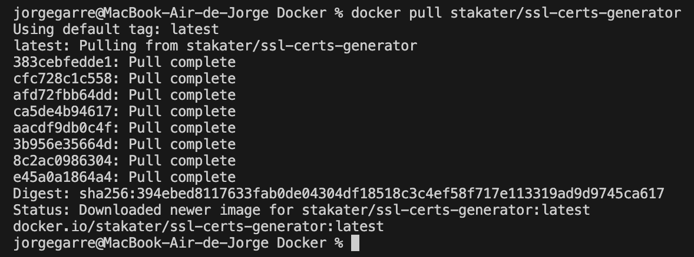
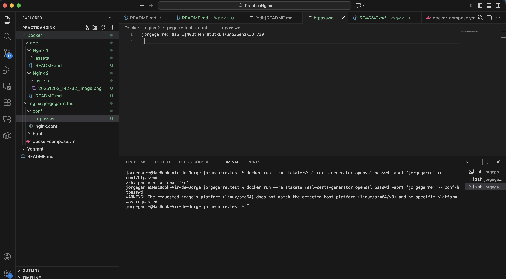
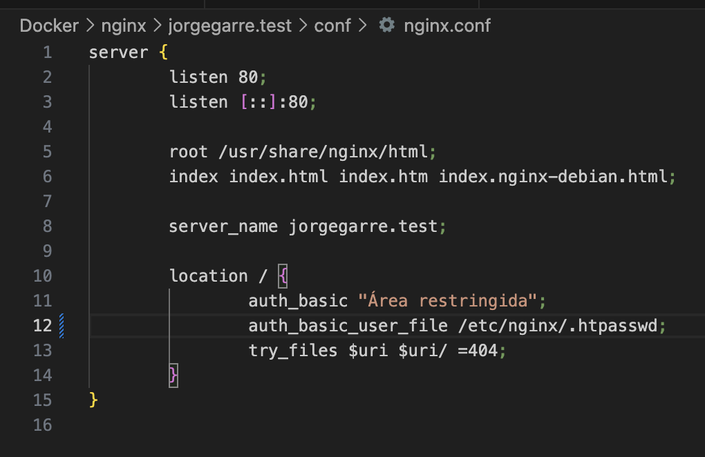
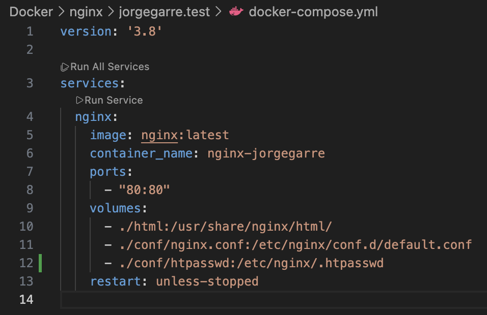
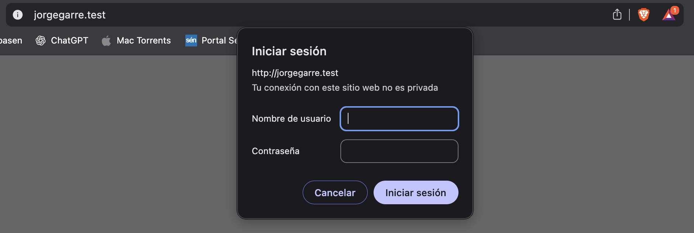
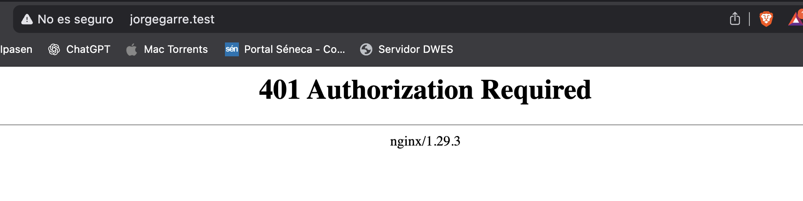
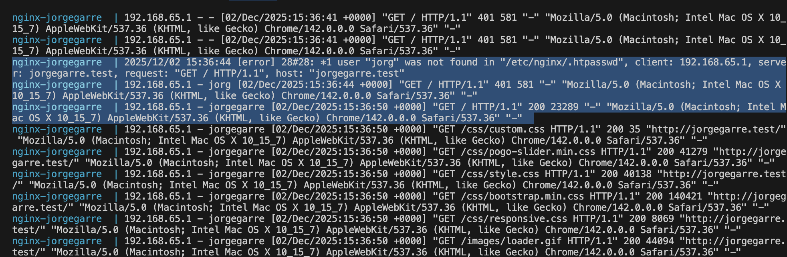
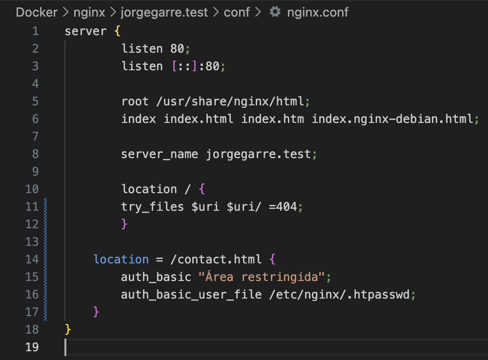
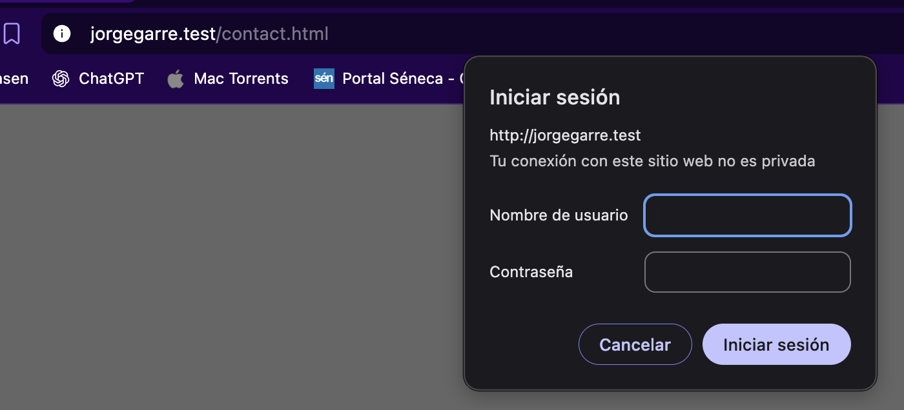

# Documentación Práctica Nginx II Autenticación Con Docker

**Autor:** Jorge Garre Corrales
**Proyecto:** Despliegue de servidor web Nginx usando Docker y Docker Compose

## 1. Instalar paquetes necesarios

Lo primero que he hecho ha sido descargar las utilidades de OpenSSL que vienen en un contenedor Docker

### 1.2 Crear usuarios y contraseñas para el acceso web

Al crear la clave me ha devuelto un warning por que el docker que se ha ejecutado es para arquitectura amd64 y mi ordenenador es arm64, pero ha creado la clave correctamente

### 1.3 Configurar Nginx.conf

He añadido la ruta del fichero que va tener la clave del servidor, en el nginx.conf

Y en el docker-compose.yml he indicado que se copie el fichero al lanzar el contenedor

### 1.4 Probar la nueva configuración

He levantado el contenedor docker y he comprobado que al acceder al servidor me pide autenticación

Y este es el mensaje que me muestra al no autenticarme

## 2. Tareas

### 2.1 T.1

En la primera linea podemos ver que dice que el user "jorg" no lo ha encontrado, ese es el log de error al autenticarse y mas abajo con el usuario jorgegarre hacer un GET HTTP 200 y eso significa que si ha accedido el usuario.

### 2.2 T.2

He hecho este cambio en mi fichero nginx.conf para que solo pida la autenticación en la página contact.html

Despues he ejecutado el comando $ docker compose restart

Y he probado como no pide autenticación al acceder al index.html de la web o navegar por ella

Pero si la pide al acceder al contact.html

