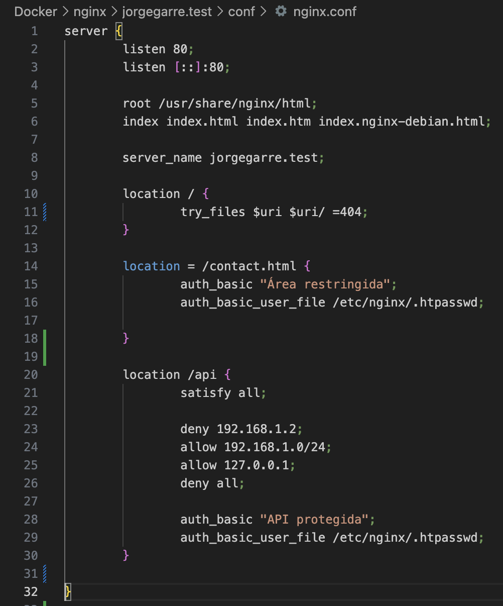
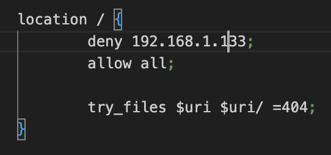
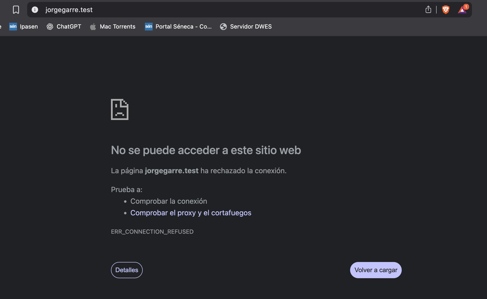

# Documentación Práctica Nginx II Autenticación Con Docker

**Autor:** Jorge Garre Corrales  
**Proyecto:** Despliegue de servidor web Nginx usando Docker y Docker Compose

---

# Índice

1. [Instalar paquetes necesarios](#1-instalar-paquetes-necesarios)  
   - [Crear usuarios y contraseñas para el acceso web](#12-crear-usuarios-y-contraseñas-para-el-acceso-web)  
   - [Configurar nginx.conf](#13-configurar-nginxconf)  
   - [Probar la nueva configuración](#14-probar-la-nueva-configuración)

2. [Tareas](#2-tareas)  
   - [T.1](#21-t1)  
   - [T.2](#22-t2)  
   - [Combinar autenticación con clave e IP](#23-combinar-autenticación-con-clave-e-ip)

3. [Bloquear acceso a mi máquina anfitriona](#32-bloquear-acceso-a-mi-máquina-anfitriona)

---

## 1. Instalar paquetes necesarios

Lo primero que he hecho ha sido descargar las utilidades de OpenSSL que vienen en un contenedor Docker.

### 1.2 Crear usuarios y contraseñas para el acceso web

Al crear la clave me ha devuelto un *warning* porque el Docker que se ha ejecutado es para arquitectura amd64 y mi ordenador es arm64, pero ha creado la clave correctamente.

### 1.3 Configurar Nginx.conf

He añadido la ruta del fichero que va a tener la clave del servidor, en el nginx.conf.

Y en el docker-compose.yml he indicado que se copie el fichero al lanzar el contenedor.

### 1.4 Probar la nueva configuración

He levantado el contenedor Docker y he comprobado que al acceder al servidor me pide autenticación.

Y este es el mensaje que me muestra al no autenticarse.

## 2. Tareas

### 2.1 T.1

En la primera línea podemos ver que dice que el usuario "jorg" no lo ha encontrado, ese es el log de error al autenticarse y más abajo con el usuario jorgegarre hace un GET HTTP 200 y eso significa que sí ha accedido el usuario.

### 2.2 T.2

He hecho este cambio en mi fichero nginx.conf para que solo pida la autenticación en la página contact.html.

Después he ejecutado el comando `docker compose restart` para reiniciar el contenedor.

Y he probado cómo no pide autenticación al acceder al index.html de la web o navegar por ella.

Pero sí la pide al acceder al contact.html.

### 2.3 Combinar autenticación con clave e IP

Para autenticar mediante credenciales e IP he añadido la siguiente configuración al fichero nginx.conf.

## 3

### 3.2 Bloquear acceso a mi máquina anfitriona

He reiniciado el contenedor con `docker compose restart`.

Y aquí vemos cómo no me deja acceder.

