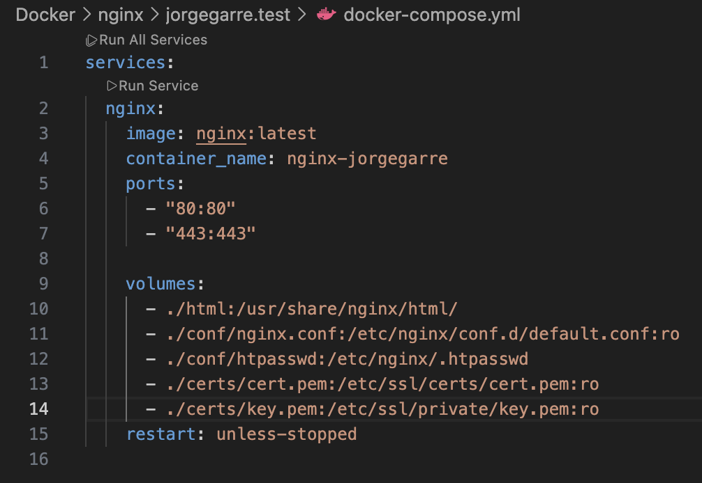

# Documentación Práctica Nginx Con Docker

**Autor:** Jorge Garre Corrales
**Proyecto:** Configurar certificado SSL en un servidor Nginx con contenedor Docker

# Índice

1. [Instalar paquetes necesarios](#1-instalar-paquetes-necesarios)

   - [Crear usuarios y contraseñas para el acceso web](#12-crear-usuarios-y-contraseñas-para-el-acceso-web)
   - [Configurar nginx.conf](#13-configurar-nginxconf)
   - [Probar la nueva configuración](#14-probar-la-nueva-configuración)
2. [Tareas](#2-tareas)

   - [T.1](#21-t1)
   - [T.2](#22-t2)
   - [Combinar autenticación con clave e IP](#23-combinar-autenticación-con-clave-e-ip)
3. [Bloquear acceso a mi máquina anfitriona](#32-bloquear-acceso-a-mi-máquina-anfitriona)

### Prerequisitos

He añadido la siguiente configuración a mi fichero /etc/hosts

## 1. Generar certificado

En la imagen se puede ver los comandos que he ejecutado para que me genere el certifcado

## 2. Configuración

He añadido la siguiente configuración a mi nginx.conf para que use el certificado SSL

Y la siguiente configuración a mi docker-compose.yml para pasarle las claves del certificado SSL

Luego he reiniciado el contenedor y me muestra lo siguiente, me muestra que no es seguro y que no tiene certificado porque lo navegadores actuales no se fian de los certificados autofirmados pero se puede apreciar que la conexión mediante la url con https es correcta por lo que esta funcionando.

