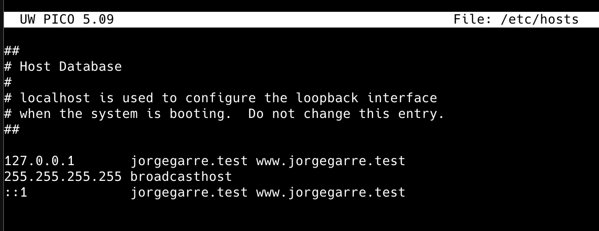
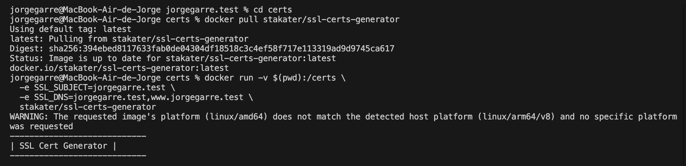
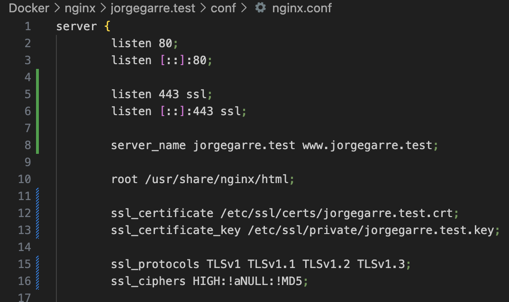
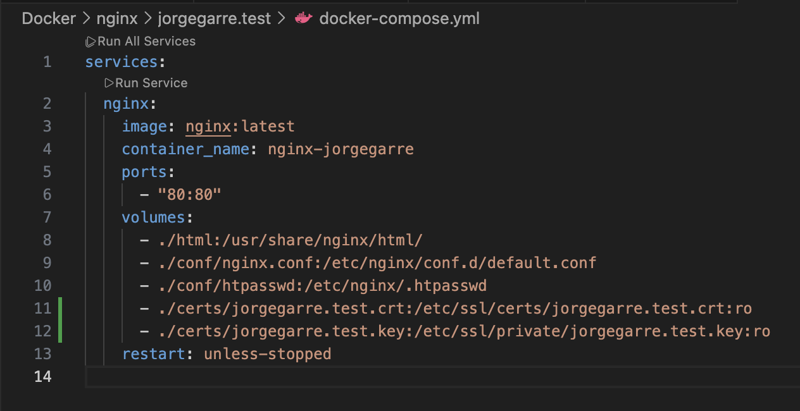

# Documentación Práctica Nginx Con Docker

**Autor:** Jorge Garre Corrales
**Proyecto:** Configurar certificado SSL en un servidor Nginx con contenedor Docker

### Prerequisitos

He añadido la siguiente configuración a mi fichero /etc/hosts

## 1. Generar certificado

En la imagen se puede ver los comandos que he ejecutado para que me genere el certifcado

## 2. Configuración

He añadido la siguiente configuración a mi nginx.conf para que use el certificado SSL

Y la siguiente configuración a mi docker-compose.yml para pasarle las claves del certificado SSL

Luego he reiniciado el contenedor
