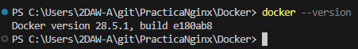
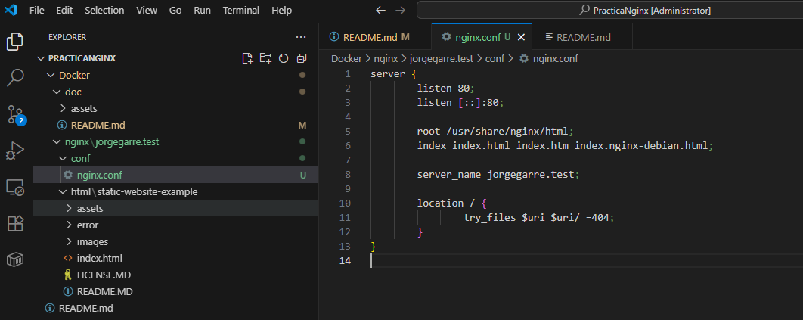
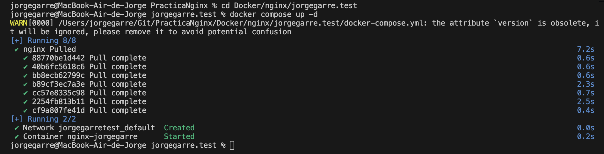
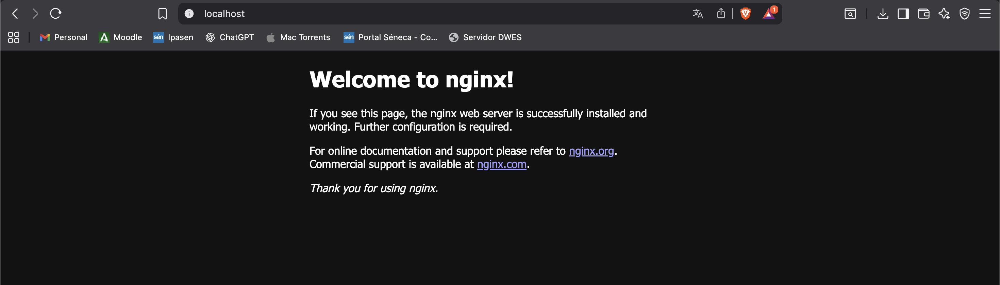

# Documentación Práctica Nginx Con Docker

**Autor:** Jorge Garre Corrales

## 1. Instalación de Docker

Lo primero que he hecho ha sido comprobar que tengo instalado Docker.

## 2. Creación de la estructura de carpetas

En la imagen se ve a la izquierda la estructura de carpetas, y como en la carpeta html esta clonado el repositorio de la práctica, además se ve el contenido de el fichero de configuración nginx.conf

## 3. Crear y ejecutar el contenedor Docker

**IMPORTANTE:** A partir de aqui he seguido haciendo la práctica desde mi ordenador (las capturas anteriores eran del ordenador de clase). Por eso se pueden ver distintas las capturas.

Para el contenedor Docker he decidido hacerlo con Compose, por lo cual he tenido que crear un fichero docker-compose.yml, con la siguiente configuración.

Ahora lanzamos el contenedor para comprobar que la configuración es correcta.

Y en el navegador comprobamos que el servidor funciona

